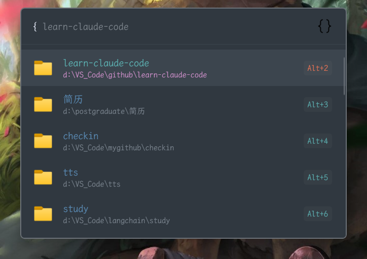

# VSCode Recent — Flow Launcher plugin

Quickly find and open your recent VS Code folders and workspaces from [Flow Launcher](https://github.com/Flow-Launcher/Flow.Launcher).



**English** | [中文](#中文)

---

Type `{`, see your recently-opened folders/workspaces (most recent first), filter by name or path, and press <kbd>Enter</kbd> to open in VS Code.

## Why this plugin
Recent VS Code builds (2026+) no longer store the recently-opened list in
`state.vscdb` under `history.recentlyOpenedPathsList` — the key the older
VSCodeWorkspaces plugins depend on, so they suddenly show nothing. This plugin
reads VS Code's **current** storage
(`User/globalStorage/storage.json`: `profileAssociations` / `backupWorkspaces` /
`windowsState`) and still falls back to the legacy `state.vscdb` key for older
versions.

## Install
**From the Flow plugin store** (once approved):
```
pm install VSCode Recent
```

**Directly from the latest release:**
```
pm install https://github.com/xt-fg/Flow.Launcher.Plugin.VSCodeRecent/releases/latest/download/Flow.Launcher.Plugin.VSCodeRecent.zip
```
Then restart Flow Launcher.

## Usage
- Type the action keyword `{` to list recent workspaces (most-recent first).
- Type part of a folder name or path to filter.
- <kbd>Enter</kbd> — open in VS Code.
- Context menu (<kbd>Ctrl</kbd>+<kbd>O</kbd> / <kbd>Shift</kbd>+<kbd>Enter</kbd>):
  Open in new window · Reveal in File Explorer · Copy path.

## Features
- Pure Python standard library — **zero third-party dependencies**.
- Reads the modern `storage.json`; legacy `state.vscdb` fallback.
- Recency-sorted (by `workspaceStorage` timestamps).
- Automatically hides folders that no longer exist.
- Local (`file://`) and remote (`vscode-remote://` — WSL / SSH / Dev Container / Codespaces).
- Multiple editors: VS Code, VS Code Insiders, VSCodium (extend via `EDITORS` in `main.py`).
- Unicode-safe output — non-ASCII paths never crash the plugin.

## Requirements
- Windows, with Flow Launcher's Python configured (Settings → General → Python).
- The `code` command on `PATH`, or VS Code in a standard install location.

## Development
Run it on WSL/Linux against your Windows VS Code data by mapping drives:
```bash
APPDATA=/mnt/c/Users/<you>/AppData/Roaming VSCWS_DRIVE_MAP=/mnt \
  python3 main.py '{"method":"query","parameters":[""]}'
```
`VSCWS_DRIVE_MAP` is a test-only hook (maps `D:\x` → `/mnt/d/x` for existence
checks) and has no effect on Windows.

## License
MIT

---

# 中文

[English](#vscode-recent--flow-launcher-plugin) | **中文**

在 [Flow Launcher](https://github.com/Flow-Launcher/Flow.Launcher) 里快速查找并打开最近用过的 VS Code 文件夹/工作区。

输入 `{` 即可列出最近打开的项(按最近时间排序),输入名字或路径过滤,按 <kbd>Enter</kbd> 用 VS Code 打开。

## 为什么需要这个插件
2026 年起的新版 VS Code 不再把"最近打开"列表写进 `state.vscdb` 的
`history.recentlyOpenedPathsList` 键——旧的 VSCodeWorkspaces 插件全靠它,于是突然
什么都不显示。本插件改读 VS Code **当前真正的**存储
(`User/globalStorage/storage.json` 里的 `profileAssociations` / `backupWorkspaces` /
`windowsState`),并保留对旧版 `state.vscdb` 键的兼容回退。

## 安装
**从 Flow 插件商店**(上架后):
```
pm install VSCode Recent
```

**直接用最新 release 安装:**
```
pm install https://github.com/xt-fg/Flow.Launcher.Plugin.VSCodeRecent/releases/latest/download/Flow.Launcher.Plugin.VSCodeRecent.zip
```
然后重启 Flow Launcher。

## 用法
- 输入动作关键字 `{` 列出最近工作区(最近的在前)。
- 输入文件夹名或路径的一部分进行过滤。
- <kbd>Enter</kbd> —— 用 VS Code 打开。
- 右键菜单(<kbd>Ctrl</kbd>+<kbd>O</kbd> / <kbd>Shift</kbd>+<kbd>Enter</kbd>):
  新窗口打开 · 在资源管理器中显示 · 复制路径。

## 特性
- 纯 Python 标准库 —— **零第三方依赖**。
- 读新版 `storage.json`;旧版 `state.vscdb` 兼容回退。
- 按"最近打开时间"排序(依据 `workspaceStorage` 时间戳)。
- 自动隐藏已删除的文件夹。
- 支持本地(`file://`)与远程(`vscode-remote://` —— WSL / SSH / Dev Container / Codespaces)。
- 多编辑器:VS Code、VS Code Insiders、VSCodium(在 `main.py` 的 `EDITORS` 里扩展)。
- 输出 ASCII 转义,中文等非 ASCII 路径绝不导致插件崩溃。

## 环境要求
- Windows,且在 Flow 设置里配置了 Python(Settings → General → Python)。
- `code` 命令在 `PATH` 中,或 VS Code 装在标准位置。

## 开发
在 WSL/Linux 上对着 Windows 的 VS Code 数据运行(映射盘符):
```bash
APPDATA=/mnt/c/Users/<你>/AppData/Roaming VSCWS_DRIVE_MAP=/mnt \
  python3 main.py '{"method":"query","parameters":[""]}'
```
`VSCWS_DRIVE_MAP` 只是测试钩子(把 `D:\x` 映射为 `/mnt/d/x` 做存在性检查),
在 Windows 上不设置即自动无效。

## 许可证
MIT
